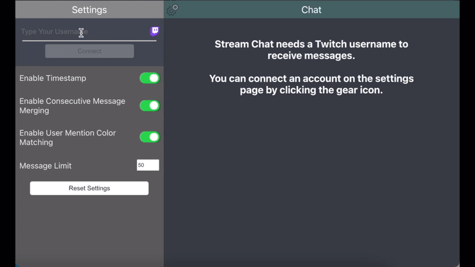
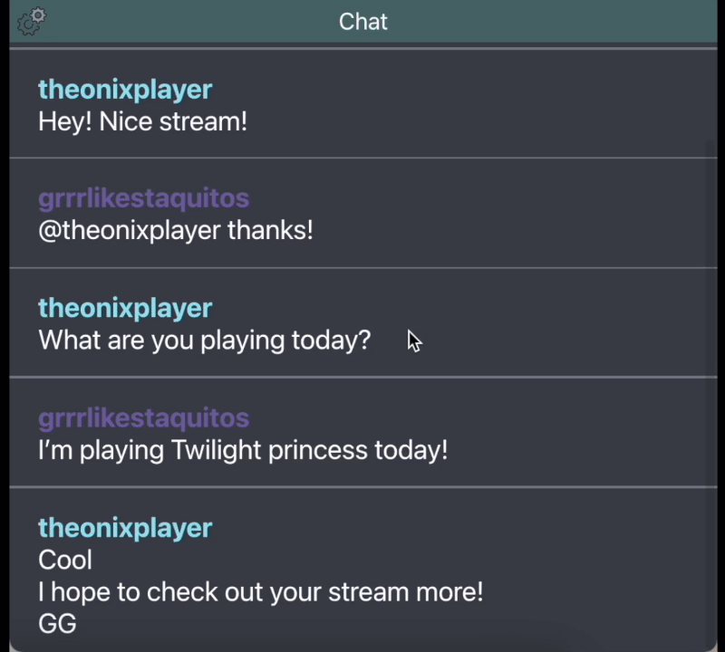

# Stream-Chat
A Stream Chat for Twitch - built with React

## Preview of Stream Chat
A quick preview on how to connect Twitch to Stream Chat.\
You can also toggle features on/off on the settings page.\
;

A quick preview on certain feature sets such as auto scrolling and changing limit of messages displayed.\
;

## Features
- Auto Scrolling (Continue/Paused)
- Scroll Through Previous Messages
- Message Timestamps
- Consecutive Message Merging
- Viewer Color Reference (@username)
- Preserve Window Size
- Settings Page
  - Persistent User Settings
  - Enable/Disable Features
  - Reset Settings
- On Launch Ask Username
- Limit Number Of Saved Messages (Default 50)

## Requested Features
- Animations (Fade In, Slide, Spring)
- Censorship/Filtering/Replace Messages
- Chat count
  - Unique visitor messages
  - Count of messages in chat
- Auto Update
- Twitch Emotes
- Streamer/Broadcaster can reply to specific messages
- Viewer badges